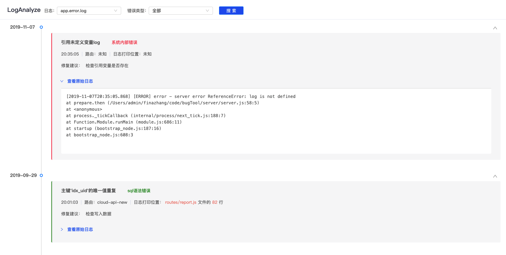

## 介绍

针对私有部署场景下，提供错误日志可视化信息展示，翻译日志信息，增加可读性。帮助部署实施同学快速定位问题。

## 特性

- 内置4中错误信息匹配规则（包括**sql**,**es**,**joi**,**internalError**, 分别对应常见的数据库，es检索，joi参数类型校验以及系统内部错误），增加错误日志可读性
- 错误信息匹配支持扩展
- 可根据日志文件检索，支持分类筛选，不通类别可指定颜色用于页面显示，按照时间轴展示日志内容，包含错误信息概览，发生时间，发生错误接口，log打印位置，原始日志等信息

页面展示效果如下


## 使用说明

1. 安装: `npm install bugtool-server`
2. 启动: `npx bugTool start -i <ip> -p <port> -d <dir> -f <fileName>`，
默认值：ip:0.0.0.0,port:10240,dir:logs(相对路径，项目根路径下logs),fileName:简单写法 `bugTool start` 
3. 浏览器访问 https://${ip}:${port},查看页面

> 若浏览器访问错误，请检查所在服务器防火墙配置，是否开通使用端口。

## 注意事项

### 日志打印格式
请确保如下格式，否则翻译信息可能会有内容缺失或错位：
```
[日期] [日志级别] 日志类型 - [日志打印文件：行数](非必须) 发生错误路由 error: 具体错误信息
```
说明：
- 日志类型：目前只支持 `error` 或 `default`, 若使用log4js, 则默认default
- 日志打印文件和行数：`可选`，若想解析日志的打印位置，请参考相关配置参考下节： [如何展示 log 打印位置](#jump)
- 发生错误路由：翻译工具默认解析格式为‘`/×××`’的字符串为路由，同时支持用户自定路由匹配前缀。若自定义路由前缀，请在扩展文件pattern.js中配置routerMatchPrefix的值

例如：

1. 日志打印文件位置：routes/report.js文件的82行，路由为cloud-api-new
```
[2019-09-29T20:01:03.427] [ERROR] error - [routes/report.js:82] /cloud-api-new error: {...}  
```
2. 无日志打印文件位置，路由为cloud-api-new（自定义路由前缀 'Router->', 须在pattern.js中配置）
```
[2019-09-29T20:01:03.427] [ERROR] default - Router->cloud-api-new error: {...} 
```


### <span id="jump">如何展示 log 打印位置</span>

需要配合所使用的日志组件增加相关配置，如果使用 log4js，需要配置`layout：pattern`,并开启`enableCallStack`属性,并保证 log4js 版本在 4.3.0 以上。[参考文档](https://github.com/log4js-node/log4js-node/blob/master/docs/layouts.md#pattern)

可参考以下配置:

```js
log4js.configure({
  appenders: {
    app: {
      type: "dateFile",
      filename: logPath,
      daysToKeep: 30,
      layout: {
        type: "pattern",
        pattern: "[%d] [%p] %c - [%f{2}:%l] %m%n",
      },
    },
  },
  categories: {
    default: {
      appenders: ["app"],
      level: "debug",
      enableCallStack: true,
    },
  },
});

const logger = log4js.getLogger("default");
```
若使用其他日志组件，请保证日志
## 用户扩展

在根目录下创建`pattern.js`文件。eg：

```js
const pattern = {
  logDir: `logs`, // 日志目录，支持绝对路径
  fileName: "app.error.log", // 日志文件名，支持正则匹配，例如`app.error.*.log`
  routerMatchPrefix: 'Router->', // 自定义路由匹配前缀
  rules: {
    //日志匹配规则
    sql: {
      color: "green",
      type: "sql",
      typeLabel: "sql语法错误",
      patternList: [
        {
          lineRegxPattern: /Table\s\'(.*)\'\sdoesn\'t\sexist/, //匹配错误信息正则表达式
          label: "引用不存在的SQL表*", //错误信息翻译信息，支持添加 * 标识，例如 Table user doesn't exist。可翻译为引用不存在的SQL表user
          suggestion: "检查数据库表或检查拼写",  //修复建议
        },
      ],
    },
  },
};
module.exports = pattern;
```
